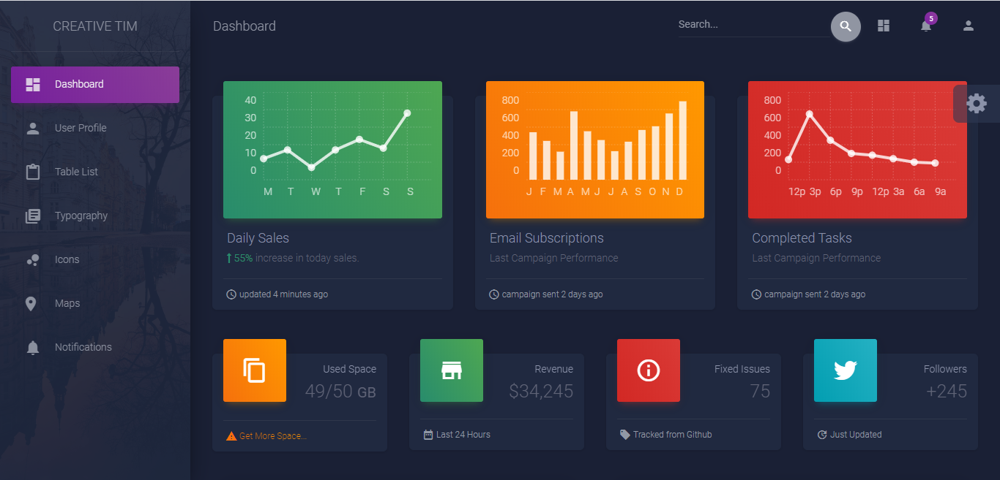
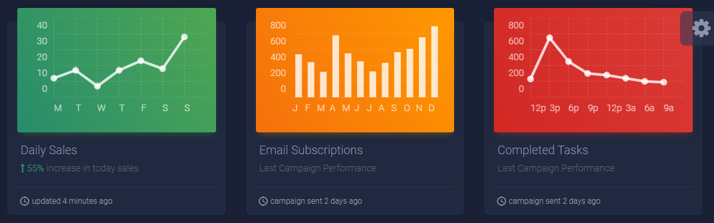
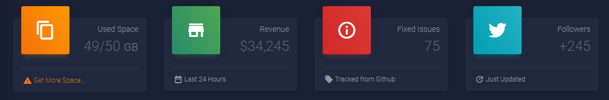
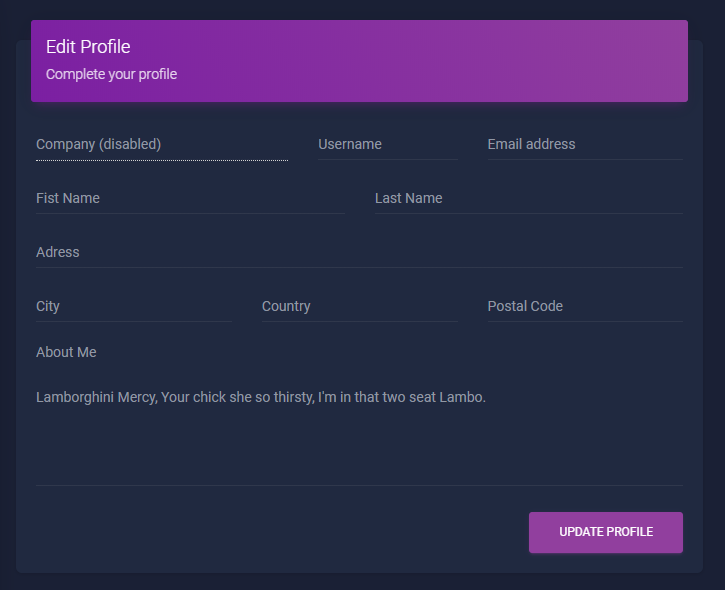
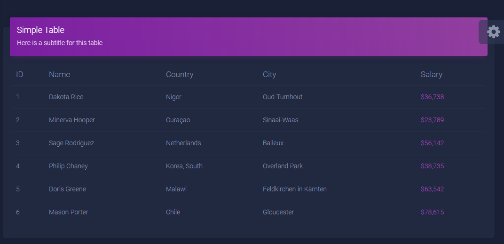
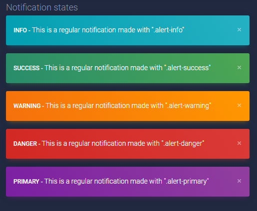

# adminlte_MaterialDashboard_2020
adminlte for Material Dashboard https://www.creative-tim.com/product/material-dashboard

#### menggunkan
<ul>
<li>Bootstrap 4</li>
<li>Font Awesome 4.7.0 </li>
</ul>

untuk melihat material icon > https://gurayyarar.github.io/AdminBSBMaterialDesign/pages/ui/icons.html

untuk melihat font-awesome icon > https://fontawesome.com/v4.7.0/icons/

untuk melihat bootstrap > 



untuk melihat template kalian bisa ke folder examples. jika kalian ingin menggunakan yg kosongan kalian bisa melihat `di template.html` atau didalam folder `demo`.




```html
  <div class="row">
            <div class="col-xl-4 col-lg-12">
              <div class="card card-chart">
                <div class="card-header card-header-success">
                  <div class="ct-chart" id="dailySalesChart"></div>
                </div>
                <div class="card-body">
                  <h4 class="card-title">Daily Sales</h4>
                  <p class="card-category">
                    <span class="text-success"><i class="fa fa-long-arrow-up"></i> 55% </span> increase in today sales.</p>
                </div>
                <div class="card-footer">
                  <div class="stats">
                    <i class="material-icons">access_time</i> updated 4 minutes ago
                  </div>
                </div>
              </div>
            </div>
            <div class="col-xl-4 col-lg-12">
              <div class="card card-chart">
                <div class="card-header card-header-warning">
                  <div class="ct-chart" id="websiteViewsChart"></div>
                </div>
                <div class="card-body">
                  <h4 class="card-title">Email Subscriptions</h4>
                  <p class="card-category">Last Campaign Performance</p>
                </div>
                <div class="card-footer">
                  <div class="stats">
                    <i class="material-icons">access_time</i> campaign sent 2 days ago
                  </div>
                </div>
              </div>
            </div>
            <div class="col-xl-4 col-lg-12">
              <div class="card card-chart">
                <div class="card-header card-header-danger">
                  <div class="ct-chart" id="completedTasksChart"></div>
                </div>
                <div class="card-body">
                  <h4 class="card-title">Completed Tasks</h4>
                  <p class="card-category">Last Campaign Performance</p>
                </div>
                <div class="card-footer">
                  <div class="stats">
                    <i class="material-icons">access_time</i> campaign sent 2 days ago
                  </div>
                </div>
              </div>
            </div>
          </div>
```



```html
    <div class="row">
            <div class="col-xl-3 col-lg-6 col-md-6 col-sm-6">
              <div class="card card-stats">
                <div class="card-header card-header-warning card-header-icon">
                  <div class="card-icon">
                    <i class="material-icons">content_copy</i>
                  </div>
                  <p class="card-category">Used Space</p>
                  <h3 class="card-title">49/50
                    <small>GB</small>
                  </h3>
                </div>
                <div class="card-footer">
                  <div class="stats">
                    <i class="material-icons text-warning">warning</i>
                    <a href="#pablo" class="warning-link">Get More Space...</a>
                  </div>
                </div>
              </div>
            </div>
            <div class="col-xl-3 col-lg-6 col-md-6 col-sm-6">
              <div class="card card-stats">
                <div class="card-header card-header-success card-header-icon">
                  <div class="card-icon">
                    <i class="material-icons">store</i>
                  </div>
                  <p class="card-category">Revenue</p>
                  <h3 class="card-title">$34,245</h3>
                </div>
                <div class="card-footer">
                  <div class="stats">
                    <i class="material-icons">date_range</i> Last 24 Hours
                  </div>
                </div>
              </div>
            </div>
            <div class="col-xl-3 col-lg-6 col-md-6 col-sm-6">
              <div class="card card-stats">
                <div class="card-header card-header-danger card-header-icon">
                  <div class="card-icon">
                    <i class="material-icons">info_outline</i>
                  </div>
                  <p class="card-category">Fixed Issues</p>
                  <h3 class="card-title">75</h3>
                </div>
                <div class="card-footer">
                  <div class="stats">
                    <i class="material-icons">local_offer</i> Tracked from Github
                  </div>
                </div>
              </div>
            </div>
            <div class="col-xl-3 col-lg-6 col-md-6 col-sm-6">
              <div class="card card-stats">
                <div class="card-header card-header-info card-header-icon">
                  <div class="card-icon">
                    <i class="fa fa-twitter"></i>
                  </div>
                  <p class="card-category">Followers</p>
                  <h3 class="card-title">+245</h3>
                </div>
                <div class="card-footer">
                  <div class="stats">
                    <i class="material-icons">update</i> Just Updated
                  </div>
                </div>
              </div>
            </div>
          </div>
```



```html
 <div class="col-md-8">
              <div class="card">
                <div class="card-header card-header-primary">
                  <h4 class="card-title">Edit Profile</h4>
                  <p class="card-category">Complete your profile</p>
                </div>
                <div class="card-body">
                  <form>
                    <div class="row">
                      <div class="col-md-5">
                        <div class="form-group">
                          <label class="bmd-label-floating">Company (disabled)</label>
                          <input type="text" class="form-control" disabled>
                        </div>
                      </div>
                      <div class="col-md-3">
                        <div class="form-group">
                          <label class="bmd-label-floating">Username</label>
                          <input type="text" class="form-control">
                        </div>
                      </div>
                      <div class="col-md-4">
                        <div class="form-group">
                          <label class="bmd-label-floating">Email address</label>
                          <input type="email" class="form-control">
                        </div>
                      </div>
                    </div>
                    <div class="row">
                      <div class="col-md-6">
                        <div class="form-group">
                          <label class="bmd-label-floating">Fist Name</label>
                          <input type="text" class="form-control">
                        </div>
                      </div>
                      <div class="col-md-6">
                        <div class="form-group">
                          <label class="bmd-label-floating">Last Name</label>
                          <input type="text" class="form-control">
                        </div>
                      </div>
                    </div>
                    <div class="row">
                      <div class="col-md-12">
                        <div class="form-group">
                          <label class="bmd-label-floating">Adress</label>
                          <input type="text" class="form-control">
                        </div>
                      </div>
                    </div>
                    <div class="row">
                      <div class="col-md-4">
                        <div class="form-group">
                          <label class="bmd-label-floating">City</label>
                          <input type="text" class="form-control">
                        </div>
                      </div>
                      <div class="col-md-4">
                        <div class="form-group">
                          <label class="bmd-label-floating">Country</label>
                          <input type="text" class="form-control">
                        </div>
                      </div>
                      <div class="col-md-4">
                        <div class="form-group">
                          <label class="bmd-label-floating">Postal Code</label>
                          <input type="text" class="form-control">
                        </div>
                      </div>
                    </div>
                    <div class="row">
                      <div class="col-md-12">
                        <div class="form-group">
                          <label>About Me</label>
                          <div class="form-group">
                            <label class="bmd-label-floating"> Lamborghini Mercy, Your chick she so thirsty, I'm in that two seat Lambo.</label>
                            <textarea class="form-control" rows="5"></textarea>
                          </div>
                        </div>
                      </div>
                    </div>
                    <button type="submit" class="btn btn-primary pull-right">Update Profile</button>
                    <div class="clearfix"></div>
                  </form>
                </div>
              </div>
            </div>
```


```html
 <div class="col-md-4">
              <div class="card card-profile">
                <div class="card-avatar">
                  <a href="#pablo">
                    
                  </a>
                </div>
                <div class="card-body">
                  <h6 class="card-category">CEO / Co-Founder</h6>
                  <h4 class="card-title">Alec Thompson</h4>
                  <p class="card-description">
                    Don't be scared of the truth because we need to restart the human foundation in truth And I love you like Kanye loves Kanye I love Rick Owens’ bed design but the back is...
                  </p>
                  <a href="#pablo" class="btn btn-primary btn-round">Follow</a>
                </div>
              </div>
            </div>
```




```html
   <div class="col-md-12">
              <div class="card">
                <div class="card-header card-header-primary">
                  <h4 class="card-title ">Simple Table</h4>
                  <p class="card-category"> Here is a subtitle for this table</p>
                </div>
                <div class="card-body">
                  <div class="table-responsive">
                    <table class="table">
                      <thead class=" text-primary">
                        <th>
                          ID
                        </th>
                        <th>
                          Name
                        </th>
                        <th>
                          Country
                        </th>
                        <th>
                          City
                        </th>
                        <th>
                          Salary
                        </th>
                      </thead>
                      <tbody>
                        <tr>
                          <td>
                            1
                          </td>
                          <td>
                            Dakota Rice
                          </td>
                          <td>
                            Niger
                          </td>
                          <td>
                            Oud-Turnhout
                          </td>
                          <td class="text-primary">
                            $36,738
                          </td>
                        </tr>
                        <tr>
                          <td>
                            2
                          </td>
                          <td>
                            Minerva Hooper
                          </td>
                          <td>
                            Curaçao
                          </td>
                          <td>
                            Sinaai-Waas
                          </td>
                          <td class="text-primary">
                            $23,789
                          </td>
                        </tr>
                        <tr>
                          <td>
                            3
                          </td>
                          <td>
                            Sage Rodriguez
                          </td>
                          <td>
                            Netherlands
                          </td>
                          <td>
                            Baileux
                          </td>
                          <td class="text-primary">
                            $56,142
                          </td>
                        </tr>
                        <tr>
                          <td>
                            4
                          </td>
                          <td>
                            Philip Chaney
                          </td>
                          <td>
                            Korea, South
                          </td>
                          <td>
                            Overland Park
                          </td>
                          <td class="text-primary">
                            $38,735
                          </td>
                        </tr>
                        <tr>
                          <td>
                            5
                          </td>
                          <td>
                            Doris Greene
                          </td>
                          <td>
                            Malawi
                          </td>
                          <td>
                            Feldkirchen in Kärnten
                          </td>
                          <td class="text-primary">
                            $63,542
                          </td>
                        </tr>
                        <tr>
                          <td>
                            6
                          </td>
                          <td>
                            Mason Porter
                          </td>
                          <td>
                            Chile
                          </td>
                          <td>
                            Gloucester
                          </td>
                          <td class="text-primary">
                            $78,615
                          </td>
                        </tr>
                      </tbody>
                    </table>
                  </div>
                </div>
              </div>
            </div>
```



```html
    <div class="col-md-6">
                  <h4 class="card-title">Notification states</h4>
                  <div class="alert alert-info">
                    <button type="button" class="close" data-dismiss="alert" aria-label="Close">
                      <i class="material-icons">close</i>
                    </button>
                    <span>
                      <b> Info - </b> This is a regular notification made with ".alert-info"</span>
                  </div>
                  <div class="alert alert-success">
                    <button type="button" class="close" data-dismiss="alert" aria-label="Close">
                      <i class="material-icons">close</i>
                    </button>
                    <span>
                      <b> Success - </b> This is a regular notification made with ".alert-success"</span>
                  </div>
                  <div class="alert alert-warning">
                    <button type="button" class="close" data-dismiss="alert" aria-label="Close">
                      <i class="material-icons">close</i>
                    </button>
                    <span>
                      <b> Warning - </b> This is a regular notification made with ".alert-warning"</span>
                  </div>
                  <div class="alert alert-danger">
                    <button type="button" class="close" data-dismiss="alert" aria-label="Close">
                      <i class="material-icons">close</i>
                    </button>
                    <span>
                      <b> Danger - </b> This is a regular notification made with ".alert-danger"</span>
                  </div>
                  <div class="alert alert-primary">
                    <button type="button" class="close" data-dismiss="alert" aria-label="Close">
                      <i class="material-icons">close</i>
                    </button>
                    <span>
                      <b> Primary - </b> This is a regular notification made with ".alert-primary"</span>
                  </div>
                </div>
```